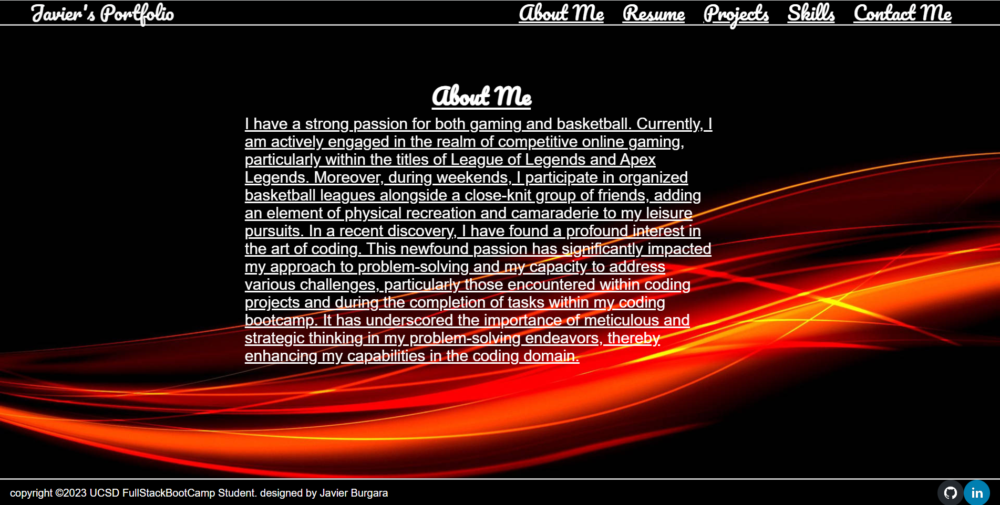

# Javier's Portfolio
 Link to Portfolio https://main--zippy-sunshine-881c02.netlify.app/
## Introduction

I am Javier Burgara, an aspiring Full Stack Developer poised to deliver comprehensive solutions. This portfolio serves as a testament to my proficiency in utilizing the MERN (MongoDB, Express.js, React, Node.js) stack—a skill set acquired and honed during my rigorous MERN Stack certification.

## Sections

- Projects
- Skills
- Experience
- Education
- Contact Information
- Images of Deployed Website

## Project Showcase

### Project 1: [Full Calendar Api]

- Using a Calendar API involves integrating a calendar service into your application or system, allowing you to manipulate and interact with calendar data programmatically
- Node.js,Handlebars,HTML,CSS,BootStrap,JavaScript,MYSQL,Express.js,Web APIs,Sever-Side API
- Link: [ https://protected-taiga-58244-3710fb729053.herokuapp.com/]

### Project 2: [Project Name]

- Description: How to use OpenWeather API to retrieve weather from several different cities in the United States. We use the OpenWeather API to retrieve Data from its weather to input what kind of weather conditions are going to happen in the next 5 days
- Technologies: UI library, HTML, CSS JavaScript,
- Link: [ https://julie0327.github.io/trails_weather/]

## Skills

- Programming Languages: [MongoDBExpress. js,React,Node. js]
- Tools: [Git,GitHub,GitLabs]
- Databases: [MongoDB,NoSQL,MySQL]

## Experience

- Full Stack Developer at UC San Diego Extended Studies: Developed and maintained web applications using the MERN stack.
  Collaborated with cross-functional teams to define, design, and ship new features.
  Implemented responsive designs and ensured high-performance optimization.
  Conducted code reviews and mentored junior developers

## Education

- MERN Stack Certificate in San Diego from UC San Diego Extended Studies

## Contact Information

- Email: [Javierburgara150@yahoo.com]
- LinkedIn: [https://www.linkedin.com/in/javier-burgara/]
- Website: [https://main--zippy-sunshine-881c02.netlify.app/]
 
## Images of Deployed Website
